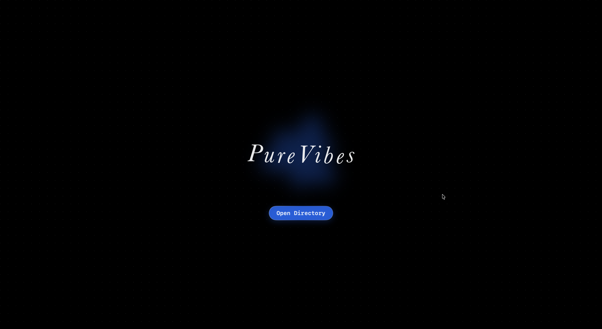
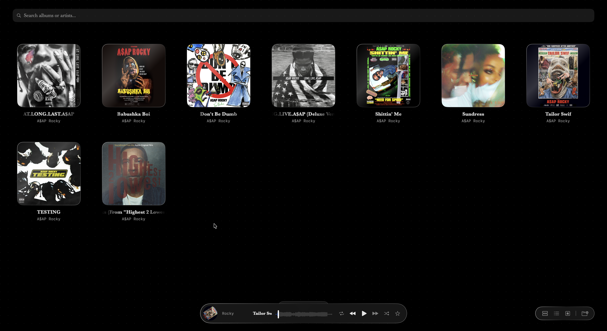
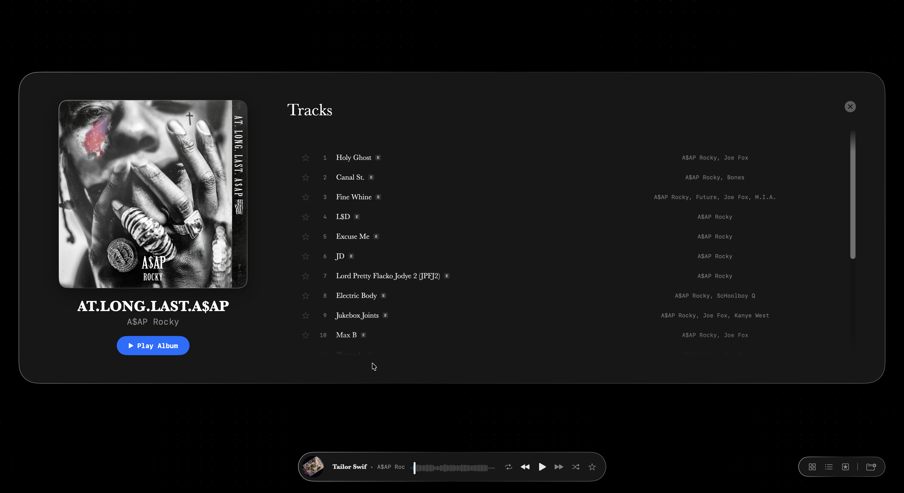
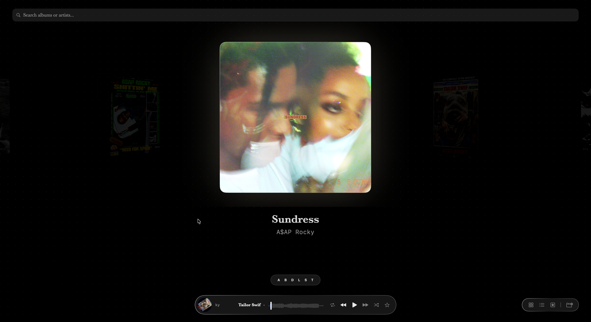
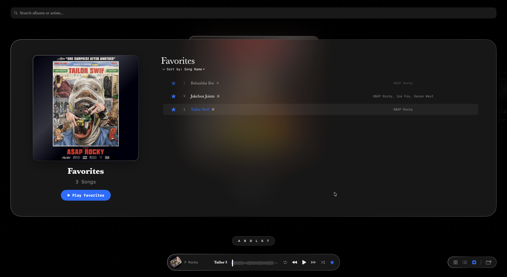
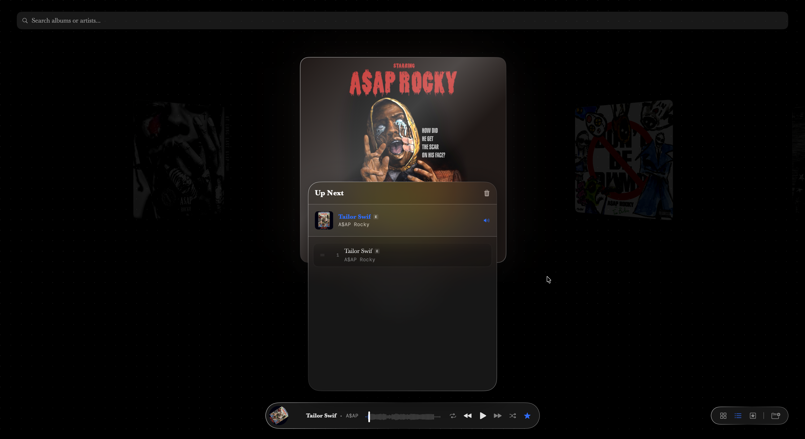

<div align="center">

<!-- Replace this comment with your hero screenshot once taken:
     
     Recommended: full-screen player view, 1600×1000px, dark mode -->

# PureVibes

**A minimal, high-fidelity music player for macOS — built entirely in Swift and SwiftUI.**

[](https://www.apple.com/macos/sonoma/)
[](https://swift.org)
[](#license)
[](https://github.com/SrikarC6/PureVibes/releases/latest)

[⬇️ Download Latest Release](https://github.com/SrikarC6/PureVibes/releases/latest) · [📋 Changelog](CHANGELOG.md) · [🐛 Report a Bug](https://github.com/SrikarC6/PureVibes/issues/new?template=bug_report.md)

</div>

---

## What Makes PureVibes Different

Most music players treat local libraries as a downgrade from streaming. PureVibes treats them as the main event. It's built for listeners who care about their files — the people with lossless rips, carefully tagged libraries, and Apple Digital Masters sitting on a hard drive, not a server.

Under the hood, PureVibes does things most players don't bother with: it reverse-engineers Apple's Digital Master tagging atoms, computes perceptual luminance from artwork using ITU-R BT.709 coefficients to pick readable text colors, and persists waveform energy maps to CoreData so your scrubber loads instantly every time. No Electron, no web views — pure native SwiftUI on AVFoundation.

---

## Table of Contents

- [Screenshots](#screenshots)
- [Features](#features)
- [Requirements](#requirements)
- [Installation](#installation)
- [Usage](#usage)
- [Architecture Highlights](#architecture-highlights)
- [Roadmap](#roadmap)
- [Known Issues](#known-issues)
- [Contributing](#contributing)
- [Built With](#built-with)
- [License](#license)

---

## Screenshots








<!-- Uncomment and replace paths once you have screenshots:

| Album Carousel | Now Playing | Track List |
|:-:|:-:|:-:|
|  |  |  |

| Full Screen | Waveform Scrubber |
|:-:|:-:|
|  |  |

-->

---

## Features

### 🎛️ Playback
- **Album Carousel** — iPod Cover Flow-inspired 3D-tilt browsing with smooth animated transitions; switchable to grid layout
- **Waveform Scrubber** — RMS energy waveform computed on import, persisted to CoreData for zero-latency display on subsequent loads; drag to seek
- **Queue Management** — drag-to-reorder, play next, add to end, and per-track removal
- **Loop Modes** — off → queue loop → single-track loop
- **Shuffle** — queue-aware shuffle that preserves the original order for un-shuffle

### 🎵 Library & Metadata
- **Apple Digital Master Detection** — reads the `flvr:2` atom and `atID`+`cnID` catalog pair tag to identify ADM-mastered files; no Apple Music subscription required
- **Full ID3 + MP4 Tag Support** — title, artist, album artist, track/disc numbers (including `x/y` fraction format and raw binary atoms), explicit/clean advisory badges
- **Loose Artwork Fallback** — automatically finds `cover.jpg`, `folder.png`, and similar filenames in the track's directory if no embedded artwork is present
- **Quality Tiers** — lossless (ALAC/FLAC), high (≥320 kbps), medium (≥192 kbps), low; color-coded in the track list

### ⚡ Performance
- **3-Tier Artwork Cache** — full-resolution `NSCache` (128 MB), thumbnail `NSCache` (32 MB), and a dictionary for dominant colors; auto-evicts under thermal and memory pressure
- **Adaptive Performance Mode** — full animations for ≤200 tracks, balanced for ≤500, lite for larger libraries
- **Lazy Track Resolution** — stubs are stored at scan time; full `AVAsset` metadata is resolved on demand and kept in a bounded 100-item LRU cache
- **Perceptual Luminance** — ITU-R BT.709 coefficients (`0.2126R + 0.7152G + 0.0722B`) used for artwork brightness and contrast ratio calculations, ensuring readable UI overlays

### 🖥️ System Integration
- **Now Playing & Media Keys** — full `MPNowPlayingInfoCenter` integration; play/pause, next/prev, and seek work from the keyboard, Touch Bar, and Control Center
- **Security-Scoped Bookmarks** — folder access survives app restarts without re-prompting for permission
- **Multi-Folder Libraries** — select multiple root directories in a single session

### 📁 Supported Formats
`.m4a` (AAC, ALAC) · `.mp3` · `.flac` · `.wav` · `.ogg`

---

## Requirements

| Requirement | Version |
|-------------|---------|
| macOS | Sonoma 14.0+ |
| Xcode (to build) | 15.0+ |
| Swift (to build) | 5.9+ |

---

## Installation

### Option A — Download the app (recommended)

1. Go to [**Releases**](https://github.com/SrikarC6/PureVibes/releases/latest) and download the `.dmg` file
2. Open the `.dmg`, drag **PureVibes** to your `Applications` folder
3. Eject the installer and delete the `.dmg`
4. On first launch, macOS may show a security warning — see [Known Issues](#known-issues) for the one-time fix

### Option B — Build from source

```bash
git clone https://github.com/SrikarC6/PureVibes.git
cd PureVibes
open MusicApp.xcodeproj
```

Select the `MusicApp` scheme, choose your Mac as the target, and press **⌘R**.

---

## Usage

1. **Open a library** — click the folder icon in the mini player (or use the welcome screen on first launch) to select one or more folders containing your music files
2. **Browse** — use the Album Carousel to flip through your library, or switch to Grid view for a denser layout
3. **Play** — click any album to load it into the queue, or click an individual track
4. **Control playback** — use the on-screen controls, your keyboard media keys, or Control Center

---

## Architecture Highlights

PureVibes is a personal project and its source is open to read. A few notable implementation choices:

**Apple Digital Master Detection** — rather than relying on undocumented APIs, the player inspects raw iTunes metadata atoms: the `flvr` atom value (`2` = ADM), the co-presence of `atID` (Apple Track ID) and `cnID` (Catalog Number), and the `ownr` ownership atom. Any of these three signals sets the `isAppleDigitalMaster` flag.

**Waveform Engine** — `MusicPlayer.extractWaveform(from:)` reads the full `AVAudioPCMBuffer`, divides it into 60 equal chunks, and computes the RMS energy per chunk using a strided sample pass (every ~100th frame) for speed. Results are stored in CoreData via `PersistenceService` so subsequent loads are instant.

**Artwork Cache Architecture** — `ArtworkCache` uses two `NSCache` instances (one for full-res 400×400 images, one for downscaled thumbnails keyed by `"\(albumID)_\(maxSize)"`), plus a plain dictionary for SwiftUI `Color` values. Memory pressure is handled via `ProcessInfo.thermalStateDidChangeNotification`, `NSApplication.didChangeOcclusionStateNotification`, and a `DispatchSource.makeMemoryPressureSource` for system-level warnings.

**Perceptual Brightness** — `NSImage.averageBrightness()` and `contrastRatio()` use ITU-R BT.709 luminance weights, the same standard used by CSS and HDR display pipelines, to determine whether to render light or dark text over artwork backgrounds.

---

## Roadmap

- [ ] Last.fm scrobbling
- [*] Gapless playback
- [ ] Smart playlists / auto-queues based on tags or quality tier
- [ ] Lyrics display (synced where available in metadata)
- [ ] EQ / audio effects chain
- [ ] Column browser (genre → artist → album)
- [ ] Export library stats

Have a feature idea? [Open an issue](https://github.com/SrikarC6/PureVibes/issues/new).

---

## Known Issues

- **macOS Gatekeeper warning** — because the app is distributed outside the App Store and is not notarized, macOS will block it on first launch. To open it: go to **System Settings → Privacy & Security**, scroll to the "Security" section, and click **Open Anyway** next to PureVibes. This is a one-time step.
- **FLAC/OGG on older macOS** — AVFoundation's support for these formats varies by OS version. FLAC works reliably on Sonoma+; OGG may not play on all configurations.

---

## Contributing

This is a personal project and is not actively maintained as open-source, but issues and suggestions are welcome. If you find a bug, please [open an issue](https://github.com/SrikarC6/PureVibes/issues/new?template=bug_report.md) with your macOS version, the file format involved, and steps to reproduce.

Pull requests are welcome for bug fixes. Please open an issue first for any feature changes.

---

## Built With

- [Swift](https://swift.org) + [SwiftUI](https://developer.apple.com/xcode/swiftui/) — UI and app logic
- [AVFoundation](https://developer.apple.com/av-foundation/) — audio playback and metadata parsing
- [CoreData](https://developer.apple.com/documentation/coredata) — waveform and track cache persistence
- [MediaPlayer](https://developer.apple.com/documentation/mediaplayer) — Now Playing integration and media key support
- Development assisted by [Claude Code](https://claude.ai/code) and [Gemini CLI](https://github.com/google-gemini/gemini-cli)

---

## License

Distributed under the MIT License. See [`LICENSE`](LICENSE) for details.

---

<div align="center">
<sub>Made with 🎵 by <a href="https://github.com/SrikarC6">SrikarC6</a></sub>
</div>
